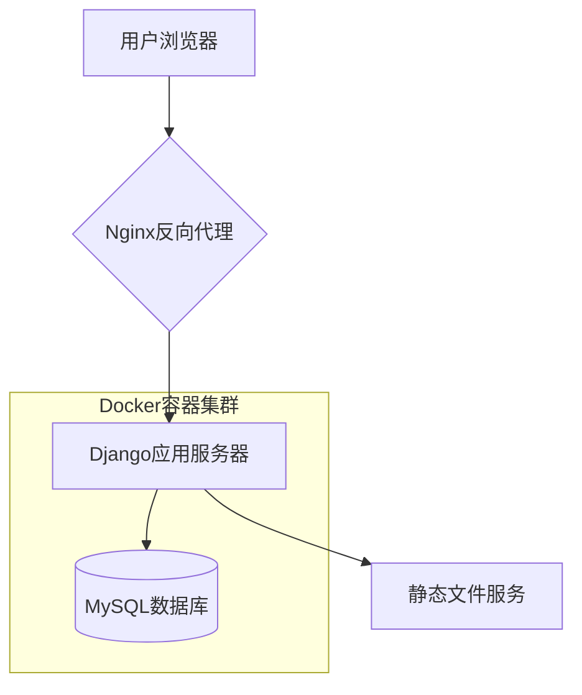

# 玻璃加工销售分析系统

## 项目概述
本系统是一个基于Django框架开发的玻璃加工销售数据分析平台，旨在为玻璃加工企业提供高效、智能的数据管理与销售分析工具。系统支持多维度销售数据的上传、管理、分析与可视化，帮助企业洞察市场趋势、优化经营决策。

**主要功能包括：**
- 销售数据上传与管理：支持批量CSV导入，自动校验与清洗。
- 大型玻璃加工销售分析：按产品类型、客户地区、时间等多维度统计分析。
- 单公司销售趋势分析：可针对特定客户进行历史销售趋势追踪。
- 数据可视化展示：内置多种图表（折线、柱状、饼图等），直观展现业务数据。
- 用户权限管理：支持多角色分级权限，保障数据安全。

## 项目结构

```
glass_analysis/
├── config/               # Django项目配置（包含全局设置、数据库、路由等）
│   ├── __init__.py
│   ├── settings.py       # 数据库、静态文件、第三方库等配置
│   ├── urls.py           # 项目主路由，分发到各子应用
│   └── wsgi.py           # WSGI启动入口
├── sales/                # 销售分析应用（核心业务逻辑）
│   ├── migrations/       # Django数据库迁移文件
│   ├── templates/        # 前端模板（基于Bootstrap+Chart.js）
│   │   └── sales/
│   │       ├── base.html        # 基础模板，包含导航栏、布局
│   │       ├── dashboard.html   # 数据看板，展示核心图表
│   │       └── data_upload.html # 数据上传页面
│   ├── urls.py           # 应用内路由，细分各功能模块
│   ├── views.py          # 视图函数，处理请求与业务逻辑
│   ├── models.py         # ORM模型，定义数据表结构
│   └── utils.py          # 数据分析与处理工具函数
├── docker-compose.yml    # Docker编排配置，定义服务依赖
├── db/
│   ├── Dockerfile        # MySQL数据库镜像构建文件
│   ├── init.sql          # 数据库初始化脚本（表结构、初始数据）
│   └── data.sql          # 示例销售数据SQL
├── requirements.txt      # Python依赖包清单
├── manage.py             # Django管理脚本（迁移、启动等）
├── img/                  # 系统生成的可视化图片
└── django_app/           # Django主应用目录（包含项目代码、脚本等）
```

**代码说明：**
- `config/settings.py`：配置数据库连接、静态文件路径、第三方库等。
- `sales/models.py`：定义销售数据、用户扩展等ORM模型。
- `sales/views.py`：实现数据上传、分析、可视化等核心业务逻辑。
- `sales/templates/`：前端页面模板，支持响应式布局和交互式图表。
- `db/init.sql`、`db/data.sql`：数据库表结构及示例数据，便于快速初始化。
- `docker-compose.yml`：一键部署，自动拉起Django与MySQL服务。

## 路由与功能说明

### 主要功能路由
- `/` 仪表盘：展示销售数据概览和多维度可视化图表，支持筛选与导出。
- `/upload/` 数据上传：支持CSV格式销售数据批量上传，自动校验格式与内容。
- `/large-sales/` 大型销售分析：按产品类型、客户地区、时间等多维度统计分析，支持图表切换与导出。
- `/single-company/` 单公司分析：针对特定客户，展示其历史销售趋势、贡献度等。

### 用户与权限管理路由
- `/login/`, `/logout/`, `/register/`：用户登录、登出与注册，采用Django认证体系。
- `/profile/`：个人资料管理，支持修改密码、邮箱等。
- `/users/`：用户权限管理，仅管理员可见，支持角色分配与权限调整。

**完整路由配置（sales/urls.py）示例：**
```python
from django.urls import path
from . import views, views_data_management

urlpatterns = [
    # 仪表盘与数据管理
    path('', views.dashboard, name='dashboard'),
    path('upload/', views_data_management.data_upload, name='data_upload'),

    # 用户认证系统
    path('login/', views.login_view, name='login'),
    path('logout/', views.logout_view, name='logout'),
    path('register/', views.register_view, name='register'),

    # 销售数据分析API
    path('large-sales/', views_data_management.LargeSalesListView.as_view()),
    path('single-company/', views_data_management.SingleCompanyListView.as_view()),
]
```

**路由说明：**
- 所有分析API均支持GET/POST请求，返回JSON或渲染模板。
- 权限校验基于Django用户体系，敏感操作需登录。

## 部署与运行手册

### 一键Docker容器化部署
1. **首次部署步骤**
```bash
# 构建并启动Django与MySQL服务
# 首次部署需加 --build 参数确保镜像最新
$ docker-compose up -d --build
```
2. **常规启动/停止/重启**
```bash
# 启动服务
$ docker-compose up -d
# 停止服务
$ docker-compose down
# 重启服务
$ docker-compose restart
```
3. **数据库初始化与数据导入**

这里有自动化导入，但可能要求启动两次docker

首次启动可能需要一段时间来训练模型，可能会有延迟

5. **访问系统**
- 默认Django服务监听8000端口，浏览器访问 http://localhost:8000/
- 可通过`img/`目录下图片查看系统生成的可视化结果

### 配置文件说明
1. **数据库配置（docker-compose.yml）**
```yaml
environment:
  DB_HOST: db
  DB_NAME: glass_analysis
  DB_USER: root
  DB_PASSWORD: 123456
```
2. **MySQL配置（db/Dockerfile）**
```Dockerfile
ENV MYSQL_ROOT_PASSWORD=123456
ENV MYSQL_DATABASE=glass_analysis
```
3. **Django配置（config/settings.py）**
- `DATABASES`字段指定数据库连接信息，需与docker-compose一致。
- `STATIC_ROOT`、`MEDIA_ROOT`指定静态/媒体文件路径。
- `INSTALLED_APPS`包含`rest_framework`、`sales`等核心应用。

### 依赖安装
- 所有依赖已在`requirements.txt`中列出，Docker自动安装。
- 如需本地调试，可手动运行：
```bash
pip install -r requirements.txt
```

## 系统架构与技术栈

### 系统逻辑架构图


### 技术选型说明
- **前端**：HTML5 + Bootstrap（响应式布局）+ Chart.js（交互式图表）
- **后端**：Django 3.2（主框架）+ Django REST Framework（API接口）
- **数据库**：MySQL 8.0，支持大数据量高效存储与查询
- **部署**：Docker（容器化）、Nginx（反向代理，静态资源加速）

### 业务流程简述
1. 用户通过浏览器访问系统，Nginx负责请求转发与静态资源分发。
2. Django后端处理业务逻辑，包括数据上传、分析、可视化等。
3. 所有销售数据存储于MySQL数据库，支持高并发读写。
4. 前端页面通过模板渲染与Chart.js实现数据可视化。

---

## 附录

### 数据库表结构示例（部分）
详见`db/init.sql`、`db/data.sql`，与Django模型完全对应。
```sql
CREATE TABLE `sales_salesdata` (
  `id` bigint NOT NULL AUTO_INCREMENT,
  `month` varchar(10) NOT NULL,
  `product` varchar(50) NOT NULL,
  `sales_volume` double DEFAULT NULL,
  `sales_amount` double NOT NULL,
  `cost` double DEFAULT NULL,
  `gross_margin` double NOT NULL,
  `unit_price` double NOT NULL,
  `material_ratio` double NOT NULL,
  `major_client` varchar(100) NOT NULL,
  PRIMARY KEY (`id`)
) ENGINE=InnoDB DEFAULT CHARSET=utf8mb4 COLLATE=utf8mb4_unicode_ci;
```

### 常见问题与建议
- **数据上传失败？** 检查CSV格式及字段是否与模板一致。
- **无法访问系统？** 确认Docker服务已启动且端口未被占用。
- **权限不足？** 请联系管理员分配相应角色。

---

如需进一步技术支持或定制开发，请联系项目维护者。
